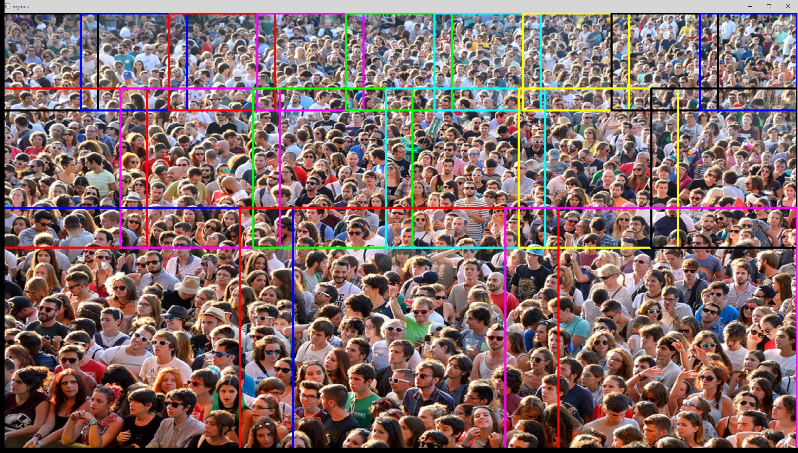
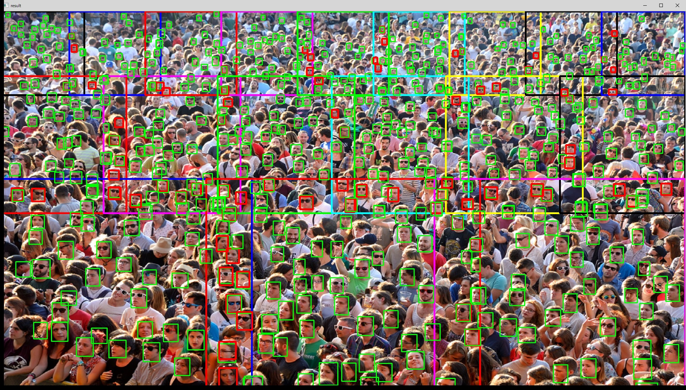

# Object (Face) Detection Demo with Adaptive Partitioning to Improve Detection Rate
This is a demo program to demonstrate an idea for improving the detection rate of the deep learning based object detection application.  
In general, the input shape (or size) of the deep learning model is fixed. The input image is scaled to fit the input shape before starting inferencing. The input shape could be 300x300 or 500x500 in the most cases which is very small compared to the resolution of today's typical cameras. Therefore, the input pictures need to be shrunk before being fed to the DL models. This makes the task of finding small objects difficult.  
Usually, the distant objects are small in the picture especially in case the camera is installed at a high position and the camera has looking down perspective.  
This program will divide the input picture into multiple regions and run object detection individually, then merge the detection results using non-maximum suppression algorithm. You can divide the input image into multiple rows and columns by modifying the parameters in the code. You can divide the top row of the image into many columns to suppress exccessive image shrinking which leads to the lower object detection rate.  

このプログラムではディープラーニングを使ったオブジェクト検出アプリケーションにおける検出率改善のアイディアの仕組みをデモします。  
通常、ディープラーニングモデルの入力シェイプ(=サイズ)は固定です。そのため、入力画像はモデルの入力シェイプに合わせてスケーリングをしてから推論を行います。モデルのシェイプは300x300や500x500など、今日の標準的なカメラの入力解像度と比べて非常に小さくなっています。そのため、入力画像は縮小されてから推論を行います。これが小さなオブジェクトの検出をさらに困難にします。  
通常、遠くにあるオブジェクトは映像に小さく映ります。特に監視カメラのように高い位置に設置され見下ろしているような場合に顕著です。  
このプログラムでは入力画像を列(row), 行(column)に分割して、分割画像ごとに推論した結果を統合し、NMS (Non-Maximum Suppression)アルゴリズムで重複検出オフジェクトを除外することで最終結果を得るようにしています。プログラム中のパラメータを変更することで列、行の分割数を変更することが可能です。上の列を細かく分割することで、遠くにあるオブジェクトが写っている領域を不必要に縮小することを避けることができるようになり、検出精度の向上が見込めます。





### Required DL Models to Run This Demo

The demo expects the following models in the Intermediate Representation (IR) format:

  * `face-detection-0100`

**This program expects the SSD type of output from the model. You can use any SSD compatible models.**

You can download those models from OpenVINO [Open Model Zoo](https://github.com/opencv/open_model_zoo).
In the `models.lst` is the list of appropriate models for this demo that can be obtained via `Model downloader`.
Please see more information about `Model downloader` [here](../../../tools/downloader/README.md).

## How to Run

(Assuming you have successfully installed and setup OpenVINO 2020.2. If you haven't, go to the OpenVINO web page and follow the [*Get Started*](https://software.intel.com/en-us/openvino-toolkit/documentation/get-started) guide to do it.)  

### 1. Install dependencies  
The demo depends on:
- `opencv-python`
- `numpy`

To install all the required Python modules you can use:

``` sh
(Linux) pip3 install -r requirements.txt
(Win10) pip install -r requirements.txt
```

### 2. Download DL models from OMZ
Use `Model Downloader` to download the required models.
``` sh
(Linux) python3 $INTEL_OPENVINO_DIR/deployment_tools/tools/model_downloader/downloader.py --list models.lst
(Win10) python "%INTEL_OPENVINO_DIR%\deployment_tools\tools\model_downloader\downloader.py" --list models.lst
```

### 3. Run the demo app
You can give input image file name in a command parameter. If you ommit the file name, 'image.jpg' will be used as the default input file name.  
``` sh
(Linux) python3 objdet-adaptive-partitioning.py <input_image_file_name>
(Win10) python objdet-adaptive-partitioning.py <input_image_file_name>
```

##### Program operatioin
 1. The program will display the bouding boxes of the divided regions over the input image for 3 seconds. 
 2. You can proceed by hitting any key or 3 seconds passes, and you'll see the detection result.
 3. You can finish the program by hitting any key or wait for 10 sec.

## Demo Output  
The application draws the results on the input image.

## Tested Environment  
- Windows 10 x64 1909 and Ubuntu 18.04 LTS  
- Intel(r) Distribution of OpenVINO(tm) toolkit 2020.2  
- Python 3.6.5 x64  

## See Also  
* [Using Open Model Zoo demos](../../README.md)  
* [Model Optimizer](https://docs.openvinotoolkit.org/latest/_docs_MO_DG_Deep_Learning_Model_Optimizer_DevGuide.html)  
* [Model Downloader](../../../tools/downloader/README.md)  
